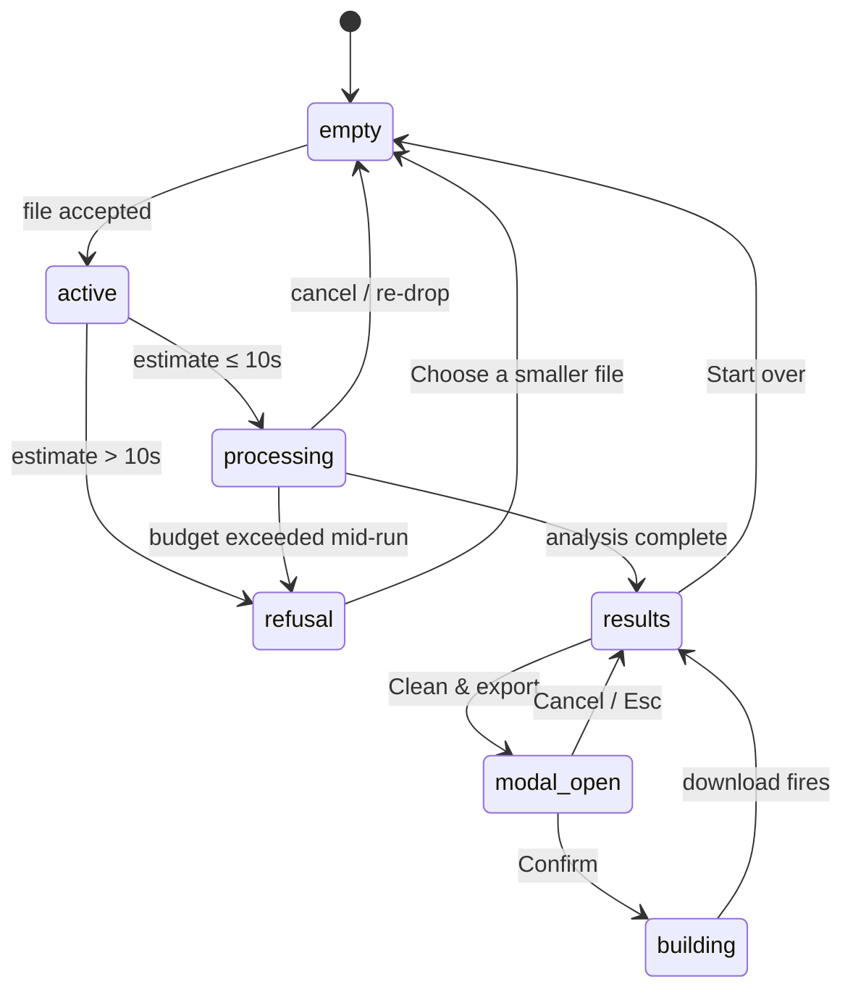
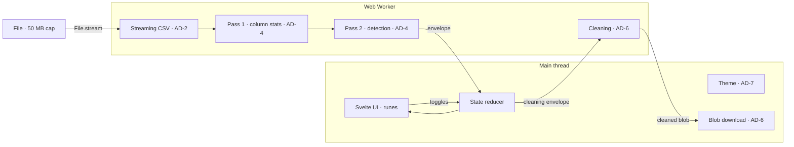

# WebUtilityLab / CSV Rescue — Architecture Spine

## Paradigm

**Local-first SPA, single-page state machine.** The page is one HTML document that morphs through empty → active → processing/refusal → results → (modal-open | results) via a single state snapshot. No routing, no server runtime, no edge functions touching the request body. All computation runs in the user's browser; all persistence is the browser's own storage.

## Boundaries

The system has exactly one process boundary: the **main thread ↔ Web Worker** seam. Everything inside the main thread is one program; everything inside the worker is one program. They communicate via a single, typed `postMessage` contract.

```
main thread                  Web Worker
─────────────────            ─────────────────
file accept (input)    ───►  parser (stream, UTF-8)
pre-flight estimate          pass 1: column stats
state machine                pass 2: detection rules
results render         ◄───  results snapshot
cleaning modal               cleaning (per toggle)
blob download
```

The worker never touches the DOM. The main thread never parses a row. Neither reaches for `localStorage` on the other's behalf.

## Decisions (ADs)

### AD-1 — Stack [ADOPTED]

**Binds:** Vite (build), Svelte 5 (UI layer, runes for reactivity), TypeScript (compile-time types).
**Prevents:** drifting to React (bundle cost, no payoff here), Astro (zero-JS-by-default is wasted — the CSV analysis is the JS), vanilla TS (DOM ergonomics at scale), or any framework whose dev tooling injects runtime calls.
**Rule:** Production `vite build` emits the static `dist/`; no runtime telemetry, no auto-injected scripts. CI builds must run with framework dev toolbars disabled.

### AD-2 — Streaming CSV parser [ADOPTED]

**Binds:** Character-by-character streaming parser using `File.stream()` piped through a `TextDecoderStream` (UTF-8, `fatal: false`); token stream interface exposing `row | field | quote | escape | BOM | EOF` events; BOM detected as a first-row flag and **surfaced as one of the 8 problem categories** with a "Strip BOM and re-detect" affordance (FR-1 + UJ-1 edge case) — never silently stripped.
**Prevents:** `FileReader.readAsText` (mangles BOM, loads whole file), loading the entire 50 MB file into a string before parsing, per-field regex re-scans during detection, and silent BOM loss.
**Rule:** Parser emits an incremental token stream — the two detection passes consume that stream without holding more than O(columns) state. The raw bytes leave memory as soon as the worker has tokenized them.

### AD-3 — Worker boundary [ADOPTED]

**Binds:** All analysis (parse + detection + cleaning) runs in a dedicated Web Worker instantiated via Vite's `new Worker(new URL('./worker.ts', import.meta.url), { type: 'module' })`. The UI thread is reserved for the static "Working…" text, the pre-flight time-band, the refusal timer, and DOM render.
**Prevents:** blocking the UI thread on parsing (defeats the 10s budget's responsiveness), blocking the worker on DOM access (worker is single-threaded and DOM-touching would force a redesign).
**Rule:** The worker contract is one typed envelope: `{ phase: 'estimate' | 'progress' | 'partial' | 'refusal' | 'results' | 'cleaned', payload }`. The main thread never peeks at the parser or detector.

### AD-4 — Two-pass detection [ADOPTED]

**Binds:** Pass 1 streams column-wise statistics (type inference, null density, distinct counts, casing variants, numeric min/max/mean/sigma, length min/max); pass 2 applies cross-row rules (duplicates by configurable key, outlier z-score on numeric columns, PII regex match, email/date format validity, inconsistent categorical grouping, missing-value detection, mixed-type flags, suspicious columns).
**Prevents:** single-pass premature outlier calls (insufficient statistics), per-row re-scanning (O(n²) blowup on duplicates), and one-shot detection that can't reason about the whole file.
**Rule:** Pass 1 completes before pass 2 begins; pass 2 may stream as it runs but only emits a finding once it has seen the full column. Findings are immutable after emission.

### AD-5 — Single immutable state snapshot [ADOPTED]

**Binds:** One `state` object owned by the main thread, mutated only via a small reducer; Svelte 5 runes subscribe to it. Transitions: `empty → active → (processing | refusal) → results → (modal-open | building | results)` with explicit `cancel-from-processing` (resets to `empty`) and `results-header-focus` (focus moves to `#problems` via `tabindex="-1"` + `.focus()`). The worker never holds the canonical state.
**Prevents:** drift across components reading different fields of truth, ad-hoc mutation in event handlers, accidental worker-side DOM coupling, and stuck processing states.
**Rule:** Every state change goes through the reducer; every UI read goes through runes. The state machine is exhaustive — there is no `unknown` state.

### AD-6 — Cleaning contract [ADOPTED]

**Binds:** Five toggles, default ALL OFF: `dedupe`, `fill-missing`, `validate-and-flag`, `normalize-categorical`, `redact-PII`. Modal opens with a **reversibility view** (original alongside proposed cleaned version with diff). Confirm is disabled until at least one toggle is on; Cancel receives initial focus. Confirm triggers `building` state ("Building cleaned file…" static text), then the worker delivers a `Blob` and a download filename `cleaned-{basename}-{YYYY-MM-DD-HHmm}.csv` is computed on the main thread; download fires via `URL.createObjectURL` + anchor click; focus returns to the trigger button.
**Prevents:** accidental data mutation, irreversible flow without preview, silent redaction, two-step collapse of build+download, and opaque filenames.
**Rule:** The modal never proceeds to Confirm unless the reversibility diff is visible. The worker never writes the cleaned file to disk — the main thread owns the download gesture and computes the filename.

### AD-7 — Theme contract [ADOPTED]

**Binds:** CSS-variable class flip on `<html>` (`.dark`); `localStorage` key `wul-theme`; first paint seeded by `prefers-color-scheme` via an inline `<script>` (no FOUC); theme transition is the **only** motion in the app — a 180 ms CSS animation gated by `@media (prefers-reduced-motion: no-preference)`. No spinners, no skeletons, no progress bars with motion.
**Prevents:** FOUC on reload, unguarded motion (violates WCAG motion criterion), theme state drifting across tabs (acceptable to defer — single-tab app posture), and motion creeping in beyond the theme transition.
**Rule:** Theme is the only thing persisted in `localStorage`. Nothing else writes to storage.

### AD-8 — Visual token discipline [ADOPTED]

**Binds:** Visual tokens live in DESIGN.md and are referenced by token name (e.g. `var(--accent)`, `var(--err)`) — never hex literals — in component CSS. Color is reserved for semantic meaning (err / warn / pii / ok / accent + `-soft` companions). Mono is for data only; sans for prose. Every color signal pairs with a redundant text label or typographic treatment (WCAG 1.4.1).
**Prevents:** hex drift across components, decorative color that erodes the editorial posture, inconsistent mode-toggling, and color-only signals that fail accessibility.
**Rule:** Components consume the CSS variables defined in DESIGN.md's `colors.semantic.*` tree. Any new color requires a new token in DESIGN.md first.

### AD-9 — Accessibility contract [ADOPTED]

**Binds:** WCAG 2.2 AA + keyboard-first floor as a hard invariant, not a recommendation: skip-links per page (`Skip to main content` on empty, `Skip to problems` on results), visible 2 px focus rings in `var(--accent)` with 2 px offset, `aria-live="polite"` regions for results banner + dropzone accept + theme change, semantic HTML (`header` / `main` / `footer` / `section` / `h1` / `h2` / `button` / `a` / `table` / `th scope="col"` / `caption` / `details` / `summary`), 44×44 CSS-px touch-target floor, modal focus trap + Esc close + restore-focus-to-trigger, error-message strict-brief template `[specific finding] — [domain rule]. [concrete next action].`, contrast 4.5:1 body / 3:1 large.
**Prevents:** shipping a visually-correct but inaccessible UI, ad-hoc ARIA, divs masquerading as buttons, color-only signals, missing keyboard handlers on the modal.
**Rule:** Any component touching the DOM commits to this floor; review checks the four forbidden patterns (no `div onClick`, no `color-only` signal, no `aria-label` where text content suffices, no `tabindex > 0`).

### AD-10 — Editorial conventions [ADOPTED]

**Binds:** Curly quotes and apostrophes in prose; spaced em-dashes ("word — word"); sentence-case headings. Mono for data only — column names, CSV content, PII matches, file paths, score values. Mono data values retain their original straight quotes and casing so they survive copy and paste back into source files. Theme toggle label is text ("Dark" / "Light"); sun and moon glyphs are decorative inside the icon (`aria-hidden`). Problem-card sample values render in `<pre>` mono. Findings headings use the locked strict-brief pattern.
**Prevents:** typography creeping into marketing register, mono leaking into prose, data values being normalized on copy, and decorative motion in icons.
**Rule:** Copy review against this convention is part of any UX change.

### AD-11 — Mechanism-B link semantics [ADOPTED]

**Binds:** Mechanism-B links (e.g. "Try API Response Diff on a sample export", "Try JSON Surgeon on a JSON column") render as link-shaped elements with `aria-disabled="true"`, visually muted (graphite color, underline preserved), and an explicit "(coming)" annotation beside the link text. The entire value is the link text; clicking does nothing for MVP because the tools do not exist yet.
**Prevents:** shipping mechanism-B as broken links (anti-trust), as live routes to nowhere (privacy violation), or as hidden/removed (loses the JTBD signal that other utilities are planned).
**Rule:** Mechanism-B is intentionally inert until the underlying tool ships; this is a feature, not a bug.

### AD-12 — Schema inference shape [ADOPTED]

**Binds:** Worker emits schema as `{columns: [{name, type, distinct, nonNull, sample}]}` in the `results` envelope payload. Type is one of `string | number | boolean | date | email | pii`. Mixed-casing and PII-pattern flags ride alongside the type field and render as color dots (warn / pii) paired with text labels ("mixed", "PII"). Schema inference is the **last** thing computed in pass 2 — it depends on pass 1 stats.
**Prevents:** per-row schema guessing (cost), schema without sample context, type flags that are color-only signals.
**Rule:** Schema is computed once per file; the main thread renders it as a `<table>` with `<caption>` and `<th scope="col">` per the UX.

## Inherited invariants (read-only from PRD + UX)

- **Privacy Baseline** (PRD FR-23): zero runtime network calls after page load; no analytics, fonts, CDN-with-logs, or error reporters; audited transitive deps; open source day 1.
- **Static deploy only**: `dist/` served from a CDN that does not log request bodies.
- **50 MB file cap** (FR-1); UTF-8 with or without BOM.
- **10-second analysis budget** (FR-6); refusal state when upper-bound estimate exceeds the budget; no partial results.
- **WCAG 2.2 AA + keyboard-first**; no spinners; static "Working…" text; `prefers-reduced-motion` respected.
- **Cleaning defaults ALL OFF** (FR-5) and reversibility view required.

## Deferred (named non-decisions)

- **PII regex library.** Vendoring vs. hand-rolled. Recommend vendoring a known-good static list (US SSN, email, phone, credit-card-shape, IBAN-shape) and auditing each pattern; no npm dep that bundles remote calls.
- **File-tree layout.** `src/lib`, `src/worker`, `src/components`, `src/styles` — the code picks the structure that best fits the ADs.
- **Build config details.** `vite.config.ts` worker plugin settings, source-map policy, asset hashing.
- **Unit-test framework.** Vitest is the natural pair to Vite; code decides.
- **Tab-scoped theme persistence.** Defer; single-tab posture holds.

## Open questions

- **Pre-flight estimate placement.** Main thread before posting the file (cheap: `file.size / heuristic`), or worker-side after first chunk? Lean: main thread — gates whether the worker even starts, and the estimate is cheap.
- **BOM handling.** Strip silently during parse, or surface as one of the 8 problem categories with a "Strip BOM and re-detect" affordance? Lean: surface it — preserves the UJ-1 edge case from the PRD where BOM was a real-world finding.

## Resolved build-time calls (closed during this run)

- **Repository license:** MIT. Audit-friendly, no copyleft, no patent clause surprises.
- **Test framework:** Vitest. Native Vite pairing, Worker support via the same syntax as production.
- **Source-map policy:** `hidden-source-map` in production builds. Maps uploaded separately to a private error store (no auto-reporting); not shipped to the browser.
- **CDN / static hosting:** Cloudflare R2 with request-body logging disabled (R2 default). Audit checklist in `SOLUTION-DESIGN.md` §"Open questions for the build" is now resolved.
- **FR-12 stable tool URLs vs single-page IA:** MVP ships single-page; hash-routing adopted only if a second tool ships.

## Diagrams

### State machine



### postMessage contract (envelope)

```ts
type Envelope =
  | { phase: 'estimate'; payload: { bytes: number; bandMs: number; upperMs: number } }
  | { phase: 'progress'; payload: { rowsParsed: number } }
  | { phase: 'partial'; payload: { findings: Finding[] } }
  | { phase: 'refusal'; payload: { reason: 'budget_exceeded'; upperMs: number; budgetMs: 10_000 } }
  | { phase: 'results'; payload: { findings: Finding[]; schema: { columns: { name: string; type: 'string' | 'number' | 'boolean' | 'date' | 'email' | 'pii'; distinct: number; nonNull: number; sample: string[]; flags: ('mixed-casing' | 'pii-pattern')[] }[] }; score: { overall: number; completeness: number; validity: number; uniqueness: number; consistency: number }; rowsParsed: number } }
  | { phase: 'cleaned'; payload: { blob: Blob; basename: string; rowCount: { original: number; cleaned: number } } };
```

### Module boundary


