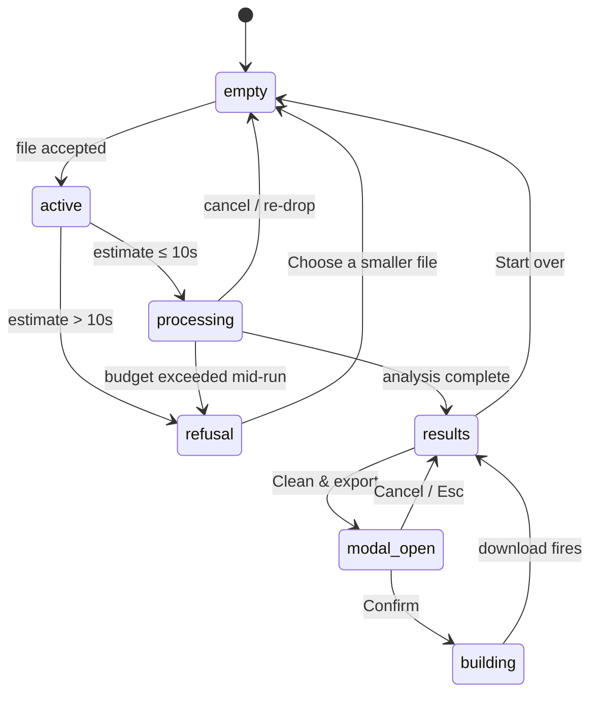

# WebUtilityLab / CSV Rescue — Solution Design

This document renders the architecture spine for builders. The spine is the contract; this is the readable map.

## One-paragraph summary

A static SPA (Vite + Svelte 5 + TypeScript) shipped as `dist/`. One HTML page morphs through empty → active → processing → results via a single state snapshot (AD-5). A dedicated Web Worker (AD-3) owns the CSV stream parser (AD-2) and a two-pass detection pipeline (AD-4). The worker never touches the DOM. The main thread never parses a row. They communicate via one typed envelope. The cleaning modal (AD-6) ships a reversibility view and the strict-brief error template. The theme (AD-7) is a CSS-variable class flip; the visual system (AD-8) is token-only. Accessibility (AD-9) and editorial voice (AD-10) are invariants, not aspirations. The Privacy Baseline (PRD FR-23) is the umbrella: zero runtime network calls after page load.

## System diagram

```mermaid
flowchart TB
  subgraph browser["User's browser"]
    direction TB

    subgraph main["Main thread"]
      direction TB
      UI[Svelte 5 UI · runes · semantic HTML]
      Reducer[State reducer · AD-5]
      Theme[Theme · AD-7]
      ThemeSeed["Inline script · prefers-color-scheme"]
      Download["Blob download · AD-6"]
    end

    subgraph worker["Web Worker · AD-3"]
      direction TB
      Parser["Streaming CSV parser · AD-2"]
      Stats["Pass 1 · column stats · AD-4"]
      Detect["Pass 2 · detection · AD-4"]
      Schema["Schema inference · AD-12"]
      Clean["Cleaning · AD-6"]
    end

    FS[("File · File.stream · UTF-8")]:::file
    Blob[("Blob · URL.createObjectURL")]:::file
  end

  FS -->|"ReadableStream chunks"| Parser
  Parser -->|"tokens"| Stats
  Stats -->|"column stats"| Detect
  Detect -->|"findings"| Schema
  Schema -->|"{findings, schema, score}"| Reducer
  Reducer -->|"state.snapshot"| UI
  UI -->|"toggles"| Reducer
  Reducer -->|"{toggles, rows}"| Clean
  Clean -->|"{blob, basename}"| Download
  Download --> Blob
  Blob -.->|"anchor click"| UI
  ThemeSeed --> Theme
  Theme -->|"class flip"| UI

  classDef file fill:var(--soft),stroke:var(--rule)
```

## Module boundaries

The codebase decomposes into exactly eight modules, each owning one AD or one clear concern:

| Module | Owns | May import | Must not import |
|---|---|---|---|
| `src/main.ts` | App bootstrap, route to `App.svelte`, mount theme seed script | `App.svelte`, `theme` | `worker/*` |
| `src/lib/state.ts` | State type, reducer, exhaustive transitions | `svelte/store` (runes), `lib/types` | DOM, worker |
| `src/lib/types.ts` | Shared types: `Finding`, `Column`, `Score`, `Envelope`, `State` | — | anything |
| `src/worker/index.ts` | Worker entry; receives envelopes from main; routes to subs | `worker/parser`, `worker/stats`, `worker/detect`, `worker/schema`, `worker/clean`, `lib/types` | DOM, Svelte |
| `src/worker/parser.ts` | AD-2 streaming CSV parser; BOM detection; token stream | `lib/types` | DOM, main-thread code |
| `src/worker/stats.ts` | AD-4 pass 1: column-wise streaming statistics | `lib/types` | DOM, main-thread code |
| `src/worker/detect.ts` | AD-4 pass 2: detection rules | `lib/stats`, `lib/types` | DOM |
| `src/worker/schema.ts` | AD-12 schema shape from stats | `lib/stats`, `lib/types` | DOM |
| `src/worker/clean.ts` | AD-6 cleaning operations | `lib/types` | DOM |
| `src/components/*` | UI; subscribe to state via runes; commit AD-9 | `lib/state`, `lib/types`, `design/*` | worker, raw `fetch` |

The boundary rule is testable: any `import` from `worker/*` in a main-thread module, or any `import` from `svelte` in `worker/*`, fails the build.

## postMessage contract (envelope)

```ts
type Envelope =
  | { phase: 'estimate'; payload: { bytes: number; bandMs: number; upperMs: number } }
  | { phase: 'progress'; payload: { rowsParsed: number } }
  | { phase: 'partial'; payload: { findings: Finding[] } }
  | { phase: 'refusal'; payload: { reason: 'budget_exceeded'; upperMs: number; budgetMs: 10_000 } }
  | { phase: 'results'; payload: {
      findings: Finding[];
      schema: { columns: Column[] };
      score: Score;
      rowsParsed: number;
    } }
  | { phase: 'cleaned'; payload: { blob: Blob; basename: string; rowCount: { original: number; cleaned: number } } };

type Finding = {
  category: 'duplicate' | 'missing' | 'invalid-email' | 'invalid-date'
           | 'inconsistent-categorical' | 'outlier' | 'suspicious-column'
           | 'pii' | 'bom';
  severity: 'err' | 'warn' | 'pii' | 'neutral';
  title: string;          // strict-brief: [finding] — [rule]
  explanation: string;
  next: string;
  affectedRows: number[]; // first N for <details> disclosure
  sampleValues?: string[];
};

type Column = {
  name: string;
  type: 'string' | 'number' | 'boolean' | 'date' | 'email' | 'pii';
  distinct: number;
  nonNull: number;
  sample: string[];
  flags: ('mixed-casing' | 'pii-pattern')[];
};

type Score = {
  overall: number;       // 0..100
  completeness: number;
  validity: number;
  uniqueness: number;
  consistency: number;
};
```

## State machine



## Pre-flight estimate (the 10-second budget)

The estimate is the load-bearing call. It gates whether the worker even starts.

```
main thread                              worker
───────────                              ──────
file.size (bytes)                        (not started)
  ↓
heuristicMs = bytes / throughput_kbps
  ↓
upperMs = heuristicMs * 1.30   (±30% band)
  ↓
upperMs > 10_000?
  ├─ yes → state = refusal (no worker spawn)
  └─ no  → state = processing
              ↓
              spawn worker (AD-3)
              post { phase: 'estimate', payload: { bytes, bandMs, upperMs } }
              ↓
              ui shows "Working… (~{bandMs}ms ±30%)"
```

The band is computed on the main thread before the worker is created. If the upper bound of the band exceeds 10 s, the worker is never spawned and the page advances to the refusal state. The worker's own estimate, if it differs, is treated as advisory — the main thread keeps the budget as the gate.

## Detection passes

```mermaid
flowchart LR
  Tokens[Token stream]:::io --> P1
  subgraph P1["Pass 1 · column stats"]
    direction TB
    TypeInf["type inference<br/>string | number | boolean<br/>date | email | pii"]
    NullDens["null density"]
    Distinct["distinct counts"]
    Casing["casing variants"]
    Numeric["numeric min/max/mean/sigma"]
    Length["length min/max"]
  end
  P1 --> P2
  subgraph P2["Pass 2 · detection rules"]
    direction TB
    Dup["duplicates · configurable key"]
    Outlier["outliers · z-score ≥ 6"]
    PII["PII · regex match"]
    Email["invalid emails · RFC 5322"]
    Date["invalid dates · format check"]
    Cat["inconsistent categorical · case-insensitive grouping"]
    Missing["missing values · empty / 'null' / whitespace"]
    Mixed["mixed-type columns"]
    Suspicious["suspicious columns"]
    BOM["BOM presence"]
  end
  P2 --> Schema[Schema · AD-12]
  Schema --> Score[Score · AD-3]
  Score --> Envelope["{ findings, schema, score }"]
  Envelope --> Main((main thread))

  classDef io fill:var(--soft),stroke:var(--rule)
```

## Cleaning contract (AD-6)

| Toggle | Default | Operation | Reversibility |
|---|---|---|---|
| `dedupe` | OFF | Drop exact-match duplicate rows by configurable key | diff shows dropped rows + count |
| `fill-missing` | OFF | Per-column strategy: empty / `null` / mean / mode | diff shows filled cells + count |
| `validate-and-flag` | OFF | Mark invalid emails/dates; do not mutate | diff shows flagged rows |
| `normalize-categorical` | OFF | Lowercase distinct values per case-insensitive group | diff shows pre/post values |
| `redact-PII` | OFF | Replace PII-pattern values with `***` | diff shows redacted values + count; **kind-error confirm** |

The reversibility view renders original alongside proposed; Confirm is disabled until at least one toggle is on; Cancel is initial focus; Confirm triggers `building` state with static "Building cleaned file…" text; on `cleaned` envelope, main thread computes `cleaned-{basename}-{YYYY-MM-DD-HHmm}.csv` and fires the download; focus returns to the trigger button.

## File map (proposed)

```
.
├── index.html                      # single page; inline theme-seed script
├── vite.config.ts                  # worker plugin settings
├── tsconfig.json
├── src/
│   ├── main.ts
│   ├── App.svelte
│   ├── lib/
│   │   ├── state.ts                # AD-5: reducer + exhaustive transitions
│   │   ├── types.ts                # Envelope, Finding, Column, Score
│   │   ├── theme.ts                # AD-7: class flip, localStorage wul-theme
│   │   ├── filename.ts             # AD-6: cleaned-{basename}-{YYYY-MM-DD-HHmm}.csv
│   │   └── estimate.ts             # pre-flight heuristic + band
│   ├── worker/
│   │   ├── index.ts                # AD-3: worker entry, envelope routing
│   │   ├── parser.ts               # AD-2: streaming CSV, BOM detection
│   │   ├── stats.ts                # AD-4: pass 1
│   │   ├── detect.ts               # AD-4: pass 2
│   │   ├── schema.ts               # AD-12
│   │   └── clean.ts                # AD-6
│   ├── components/
│   │   ├── Dropzone.svelte         # AD-9, file accept
│   │   ├── ProblemCard.svelte      # AD-9, AD-10 strict-brief
│   │   ├── ScoreRow.svelte         # AD-9 aria-hidden bar
│   │   ├── SchemaTable.svelte      # AD-12, semantic <table>
│   │   ├── CleaningModal.svelte    # AD-6, AD-9 focus trap
│   │   ├── RefusalState.svelte     # FR-6
│   │   └── ThemeToggle.svelte      # AD-7, AD-10
│   └── styles/
│       └── tokens.css              # AD-8: var(--accent), var(--err), ...
├── tests/
│   ├── parser.test.ts
│   ├── detect.test.ts
│   ├── schema.test.ts
│   ├── clean.test.ts
│   ├── estimate.test.ts
│   └── state.test.ts
└── public/
    └── (static assets only — no fonts, no CDN scripts)
```

## Accessibility floor (AD-9) — applied

- **Skip-links:** `Skip to main content` on empty; `Skip to problems` on results.
- **Focus rings:** 2 px solid `var(--accent)`, 2 px offset, on every focusable element.
- **aria-live regions:** results banner (`role="status"`), dropzone accept, theme change.
- **Semantic HTML:** no `div onClick`; `button` for actions; `a` for links; `table` with `<caption>` and `<th scope="col">` for schema.
- **44×44 floor:** every interactive element honors the CSS-px touch floor.
- **Modal:** focus trap, Esc close, focus restored to trigger.
- **Strict-brief errors:** every error message follows `[finding] — [rule]. [next action].`.
- **Contrast:** 4.5:1 body, 3:1 large, semantic dots paired with text labels.

## Privacy posture — verifiable

The Privacy Baseline (PRD FR-23) is testable:

1. Open DevTools → Network tab → "Disable cache" → reload. After page load, **zero** requests should appear.
2. `grep -r 'fetch\|XMLHttpRequest\|navigator.sendBeacon' src/` → no matches outside tests.
3. `dist/` contains no third-party domains in any `<script src>`, `<link href>`, or `@font-face`.
4. Every direct dep's transitive tree is reviewed before each release.
5. Repository is open source from day 1 — anyone can audit the claim.

## What ships

The MVP ships with:

- The eight ADs enforced as above.
- The Privacy Baseline testable per the checklist.
- One HTML page, one CSS file, one worker bundle, one JS bundle. Total transfer size target: < 200 KB gzipped.
- Five key-screens (empty, results, modal, refusal, error) implemented from the existing UX mocks.
- Three state transitions covered by automated tests: `processing → results`, `processing → refusal`, `results → modal → building → results`.

## What doesn't ship (yet)

- Mechanism-B tools (API Response Diff, JSON Surgeon) — `aria-disabled` placeholders only.
- Internationalization — English only; i18n hooks deferred.
- Hash-routing — single-page MVP. Adopt only if a second tool ships.
- Telemetry — by design, never.

## Build-time calls (resolved)

1. **Test framework:** Vitest. Native Vite pairing; Worker tests use the same `new Worker(new URL(...), { type: 'module' })` syntax as production.
2. **Source-map policy:** `hidden-source-map` in production. Maps uploaded to a private error store (manually, on the user-triggered "Report a problem" path); not shipped to the browser. DevTools never receives them.
3. **Repository license:** MIT. Audit-friendly; no copyleft; no patent clause surprises.
4. **CDN / static hosting:** Cloudflare R2 with request-body logging disabled (R2 default; bucket-level access logs off). Audit checklist:
   - (a) bucket logging disabled;
   - (b) access policy public-read on objects only;
   - (c) Cloudflare Web Analytics **not** enabled;
   - (d) verify with DevTools Network tab → zero requests after page load.
   Netlify and GitHub Pages remain fallbacks if the R2 audit fails any check.

5. **FR-12 stable tool URLs:** MVP ships single-page. Adopt hash-routing only if a second tool ships in WebUtilityLab.